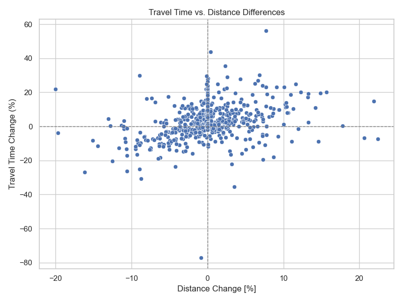

# matsim-kelheim-analysis

Usage of different files:

* [Analysis](analysis.py) calculates some basic metrics comparing the modified and the unmodified network
* [Plot analysis](plot_analysis.py) plots a basic table which compares the results
* [Plot analysis bargraph](plot_analysis_bargraph.py) plots those metrics as bargraphs
* [Affected persons](affectedPersons.py) calculates the impact on the persons affected by the change
* [Plot affected persons](plot_affectedPersons.py) plots those changes
* [Link analysis](link_analysis.py) calculates and plots the impact on the links

All files require that one modified run with 150 iterations and a speed cap at 100 km/h is completed, and one unmodified run with 100 iterations is completed.
The analysis of affected persons requires that the custom analysis Java class has calculated and saved the IDs of persons affected by the change.

Generated images can be found in the [pictures](pictures) folder. 
For example:

